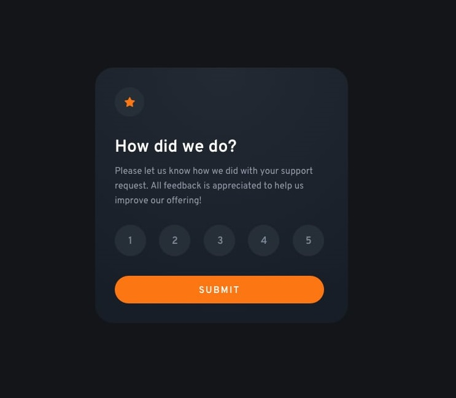
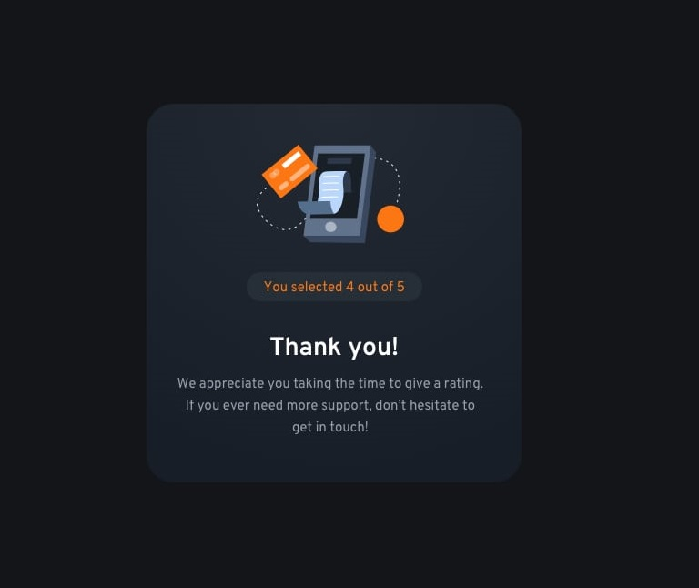
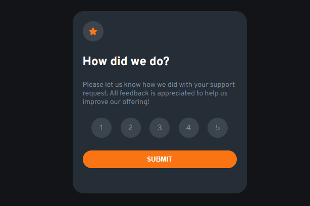

# Frontend Mentor - Interactive rating component

## O desafio

Desafio disponibilizado pela plataforma [Frontend Mentor](https://www.frontendmentor.io/challenges).

Este desafio consiste em enviar uma avaliação (seja de um atendimento, de um serviço etc) para o usuário responder. Após enviar a nota, aparecerá outro conteúdo com uma mensagem mostrando a nota dada na avaliação e junto, uma mensagem de agradecimento por participar.

### Tecnologias utilizadas
- HTML
- CSS
- Javascript

### Demonstração em video curto

### Dificuldades

**CSS:**

Para fazer essa transição da primeira parte para a segunda, Estilizei a classe `card`, que foi inserida nas 2 "telas", com a propriedade ` position: absolute;` e `opacity: 1;`. pra esconder a parte da section `thank-you`. Configurei a classe `inactive` com o `z-index: 0;` para quando fosse mostrar a section,  alterasse o z-index para 1, fazendo aparecer. Depois, criei as transições para ter uma melhor visualização. 

**Javascript:**

Precisei utilizar o loop `forEach`, para percorrer os buttons. Dentro do loop, criei o evento de click, com um if, para verificar se havia algum botão já selecionado e fizesse a remoção da seleção, para depois adicionar a classe e destacar o botão recém clicado.