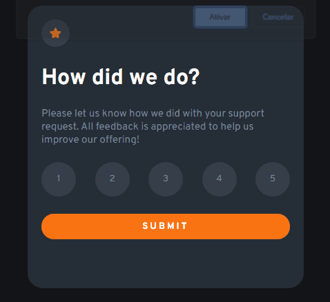

# Frontend Mentor - Interactive rating component

## O desafio

Desafio disponibilizado pela plataforma [Frontend Mentor](https://www.frontendmentor.io/challenges).

Este desafio consiste em enviar uma avaliação (seja de um atendimento, de um serviço etc) para o usuário responder. Após enviar a nota, aparecerá outro conteúdo com uma mensagem mostrando a nota dada na avaliação e junto, uma mensagem de agradecimento por participar.

### Tecnologias utilizadas
- HTML
- CSS
- Javascript

### Demonstração em video curto

### Dificuldades

CSS:

Fazer essa transição da primeira parte para a segunda, foi mais complicado. Utilizei `overflow: hidden` na div pai, para que a segunda parte, que extrapolou, ficasse escondida. Configurei a classe `inativa` com o `max-height: 0` para que aquele conteúdo da primeira parte, quando ganhasse a classe, tivesse o tamanho reduzido a 0, fazendo subir a segunda parte. Depois, criei as transições para ter uma melhor visualização. 

Javascript:

Precisei aprender o método `find` para ficar melhor de encontrar na array dos inputs, o objeto que tem a propriedade `checked`, com valor `true`.